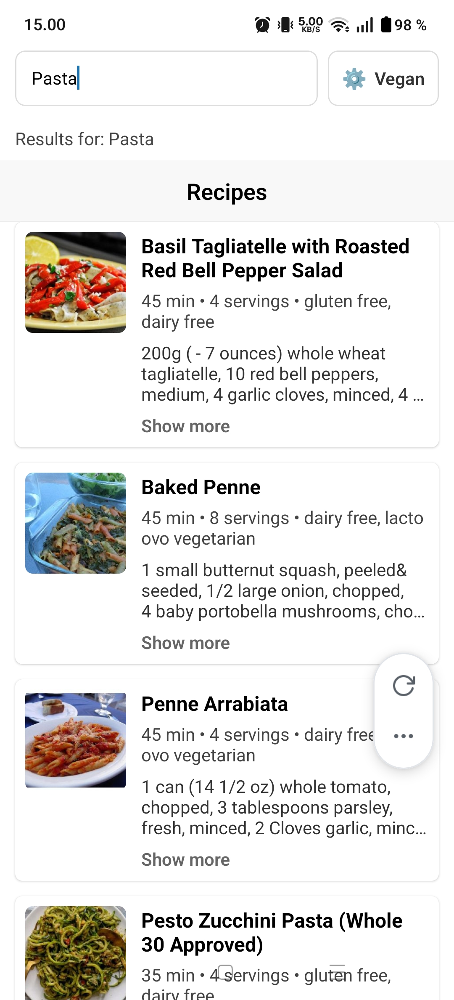
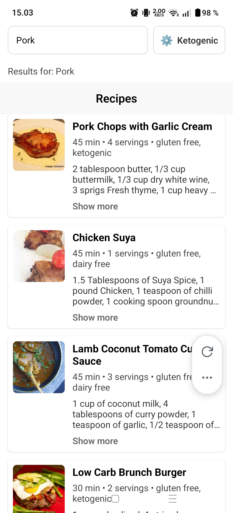
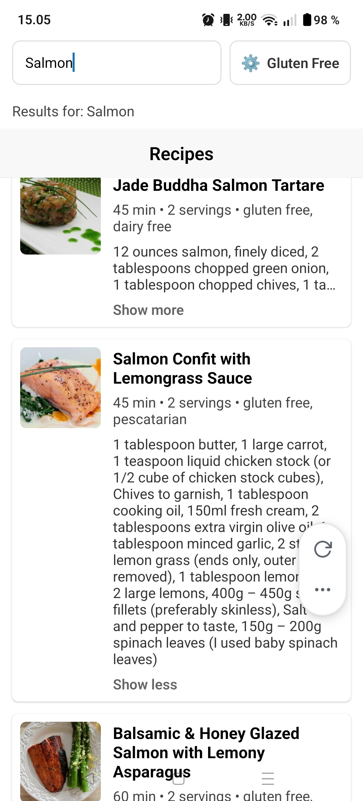
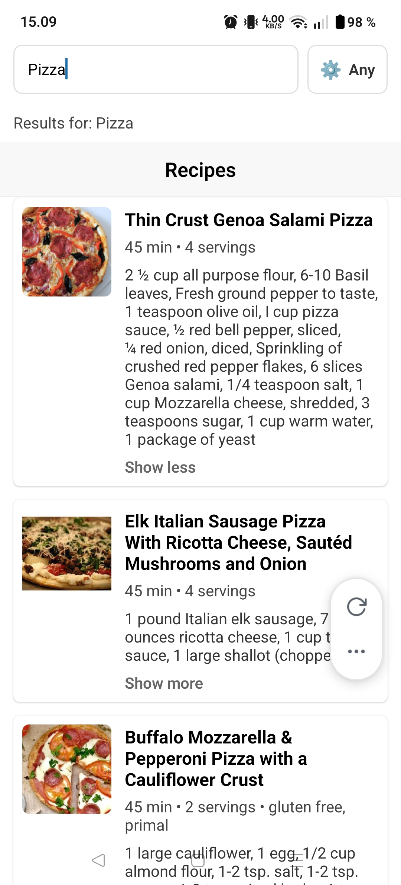

# Web- and Hybrid Technologies in Mobile Programming

**Exercise. Retrieving data from API**
> Create a mobile app based on your own idea/topic that retrieves data from free API
(open data). List of available APIs is available, for example, on https://apilist.fun, but
basically you can use whatever API you prefer providing JSON, XML or GraphQL.

## App images

    
Click to expand images

    

    

    

    
    
    

